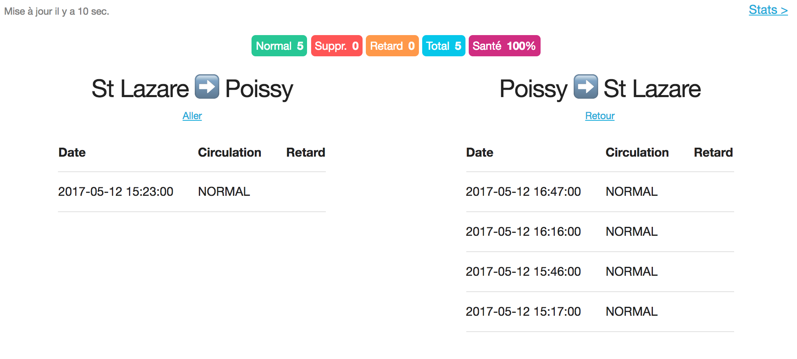
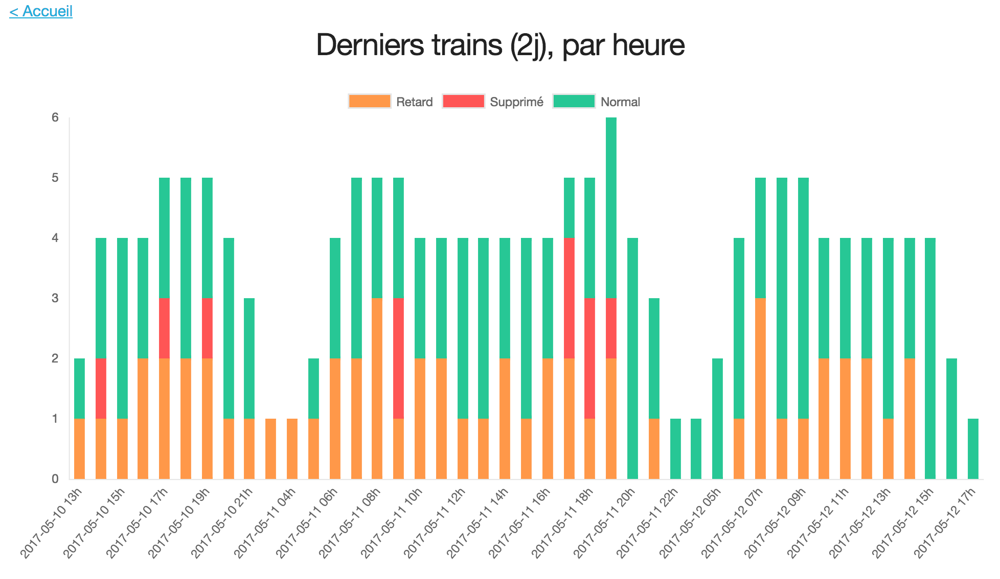

# Transilien app

This app is comprised of:

- a script to fetch the schedule for trains between two Transilien train stations and notify you when a train is canceled
- a webapp to display and analyze schedules and schedules' history





The app uses the Transilien Live API described here: https://ressources.data.sncf.com/explore/dataset/api-temps-reel-transilien/. You must apply for (free) access to the API.

## Installation

```
virtualenv -p python3 pyenv   # python3 required
. pyenv/bin/activate
pip install -r requirements.txt
```

## Usage

First, copy the config file `settings.py.sample` to `settings.py` and edit to your liking. Required parameters are:

- `FROM_STATION_CODE`: the departure train station code you want to monitor
- `TO_STATION_CODE`: the arrival train station code you want to monitor
- `TRANSILIEN_API_LOGIN` and `TRANSILIEN_API_PWD`: credentials for the Transilien API

You can enable mail and Pushbullet notifications for canceled trains, which require additionnal parameters.

Then you need to gather some data:

```
. pyenv/bin/activate
python flag.py
```

You should run this script regularly as a cron, a 5 mins interval seems good enough.

Finally you can launch the web interface:

```
. pyenv/bin/activate
python web.py
# visit http://localhost:5000
```

## Development

1. Run the API webserver as above
2. Run the frontend in dev mode:

```
cd frontend
nvm install && nvm use
npm i
npm run dev
# visit http://localhost:8080
```

## Build frontend

`cd frontend && nvm use && npm run build`

Flask will render the `dist/index.html` on `/`.
